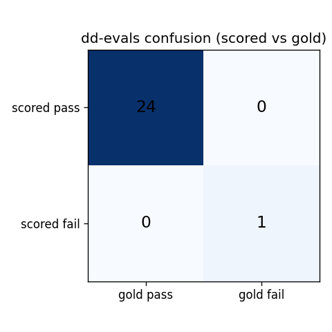
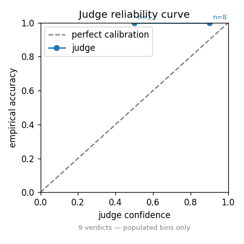

# dd-evals

**An evaluation harness that scores whether an LLM's due-diligence answers are grounded in their cited sources, honest about what is absent, and never wrong on a high-stakes yes/no.**

In counterparty due diligence a person signs the output. "Looks plausible" is not good enough: a confident answer that cites a source it does not actually support, or that quietly misses a sanctions hit, is worse than no answer at all. `dd-evals` is a small, transparent harness that grades an LLM on exactly those failure modes, on a high-stakes domain, with a judge that has to earn trust before its scores count.

It is a public, synthetic-data demonstration. It is not a production KYC product and uses no real company data.

## What it does

The system under test answers due-diligence questions about a company using only retrieved, cited sources. The harness then scores each answer:

1. **Retrieve** the relevant documents for each question from a frozen corpus.
2. **Answer** the question with the system under test, citing the source for each claim.
3. **Judge** the answer with a pinned, calibrated LLM judge for the questions where exact matching is the wrong tool.
4. **Score** every field by a named gate with a pass bar, then roll the fields up into per-gate verdicts and one overall verdict.

The same run is reproducible with no API key (see Reproduce, below).

## The gate catalog

Every field is scored by one of five gates. Deterministic gates are checked in code; only prose and citation-support gates use the model judge.

| Gate | Meaning | Method | Pass bar |
|------|---------|--------|----------|
| G1 | Deterministic field accuracy (registration number, country, dates, figures) | normalized exact compare, or a numeric tolerance band | 100% exact, numeric within 2% |
| G2 | Faithfulness: every claim is grounded in its cited source | claim-decomposition judge; any contradiction forces 0 | at least 0.98 supported |
| G3 | Honesty: a field that is absent from the sources must say so | the answer must render the not-found sentinel exactly | 100%, zero invented values |
| G4 | High-stakes binary (sanctions, legal, regulatory yes/no) | yes/no parse that refuses to credit a hedge or refusal | zero wrong answers |
| G5 | Answer relevancy: the answer addresses the question asked | answer-vs-question judge | at least 0.90 |

G3 and G4 are the gates that are hardest to fake and the ones that matter most in due diligence. G3 plants a company whose registry lists no directors, so a model that invents names is caught. G4 plants a sanctions hit on one company and clean results on others, and the parser is written so that a refusal ("not found") never counts as a clean "no".

## The calibrated judge

The judge is hand-rolled, with the only network call being to the model. It is:

- **Pinned and reproducible:** a fixed model at temperature 0, given explicit evaluation steps verbatim (no auto-generated reasoning, which is cheaper and more repeatable), one call per field, with a strict JSON verdict and a parse-retry guard.
- **Three rubrics, named in the standard vocabulary:** G-Eval (prose quality), Faithfulness (citation support by claim decomposition: extract atomic claims, check each against the cited context, any contradiction forces a zero), and Answer Relevancy.
- **Given a way out:** the judge may return "unsupported" rather than guess, which suppresses judge hallucination.

**The judge has to be calibrated before its scores count toward a release decision.** `judge_calibration.py` runs the judge against a 10-item, operator-labelled set and requires at least 85% agreement with the human. The set carries two honesty traps (a falsely asserted sanctions hit, and an invented value for an absent field). The calibration set ships with candidate answers written and the operator label filled independently, following the runbook (`judge/CALIBRATION_GUIDE.md`) whose one rule is: lock your labels before you run the judge, and never relabel an item to raise agreement.

**Measured agreement: 10/10 = 1.00 (gate ≥ 0.85), measured 2026-07-04** — committed in `judge/calibration_result.json`. The judge agreed with the operator on every item, including both honesty traps and the wrong-title near-miss (c08). This calibration was produced by a Sonnet-class stand-in judge applying the verbatim rubrics, because no API key was available for the pinned live path; the agreement is computed by `judge_calibration.compute_agreement` and is reproducible from the committed labels. Note the small N (10): the number certifies the rubric-to-human fit on this set, not a population estimate.

## Results

A real run is committed in `results/`. The system under test answered 25 fields across four companies. It got 24 right. On one field it embellished a B Corp certification with an award year and a verified score that do not appear in the cited press release, and the Faithfulness gate caught it.

| Field | Verdict |
|-------|---------|
| Overall | **fail** (one gate failed) |
| G1 field accuracy | pass (11/11) |
| G2 faithfulness | **fail** (6/7; q13 scored 0.50, two unsupported claims) |
| G3 honesty | pass (2/2, both absent-data traps) |
| G4 high-stakes binary | pass (3/3, including the planted sanctions hit) |
| G5 answer relevancy | pass (2/2) |

The single failure is the point: a fabricated award year and score, stated confidently and attributed to a real source, is exactly the error that ends a candidacy when a person signs the file. The harness scored that answer 0.50 against a 0.98 bar and failed the gate.

### Confusion matrix (harness verdict vs ground truth)



Across all 25 fields the harness agreed with ground truth: 24 sound answers accepted, the one fabricated answer rejected, zero false accepts, zero false rejects.

### Judge reliability



The committed reliability curve shows the judge's confidence across the 9 judged verdicts on this run against whether it agreed with ground truth. Only populated confidence bins are plotted (each annotated with its count); empty bins are omitted rather than drawn as zero accuracy, so the curve does not imply miscalibration where there is simply no data. The separate judge-vs-human calibration that gates a release decision is reported above (10/10 agreement, `judge/calibration_result.json`).

## Evaluation dimensions

The harness is organized around seven standard evaluation dimensions:

1. **Edge cases.** A genuine none-found (absent directors), a near-miss where the fact sits in the press release and not the registry, and a multi-hop question that combines the registry and the sanctions check.
2. **Failure modes.** See the taxonomy below.
3. **Scoring criteria.** The gate catalog and the three judge rubrics (`judge/rubrics.md`).
4. **Confusion matrix.** Above, harness verdict against ground truth.
5. **Calibration reliability curve.** Above. The judge is separately calibrated against independent human labels (10/10 agreement, `judge/calibration_result.json`).
6. **Baseline comparison.** The answer client supports a closed-book (no-retrieval) mode, so the lift from retrieval can be measured directly.
7. **Reproducibility.** A frozen corpus, a pinned judge, and one command to regenerate the committed results with no key.

## Failure-mode taxonomy

The errors the harness is built to catch:

- **Confident citation of a detail that is not in the source** (the q13 failure in this run: a fabricated award year and score).
- **Correct fact attributed to the wrong source.**
- **Silent omission of a planted adverse finding** (the G4 failure mode).
- **Inventing a value for a field that is genuinely absent** (the G3 failure mode).
- **Over-cautious "none found" when the fact is present.**

## The grader is tested too

A grader that passes everything is worthless. `mutation_check.py` seeds three known-bad mutations into a clean, passing run and requires each to fail:

- flip a deterministic field, G1 must fail,
- blank a judged answer, G2 must fail,
- flip the high-stakes sanctions answer from yes to no, G4 must fail.

The committed `results/mutation_check.json` shows all three caught. The scorer discriminates; it is not a rubber stamp.

## Reproduce it

```bash
pip install -e ".[dev]"          # editable install; no source file needs a path hack

# Regenerate the committed report and plots with no API key.
python run_eval.py --mode replay --out-dir results
python make_report_plots.py results    # confusion + reliability from ground-truth labels
python src/mutation_check.py           # regenerate the grader self-test

# Re-run against the live model (needs a key and the live extra).
pip install -e ".[live]"
export ANTHROPIC_API_KEY=...
python run_eval.py --mode live --out-dir results
```

Replay mode scores the committed answers and judge verdicts in `results/raw/` with no network call, so the results regenerate identically anywhere. Live mode runs the full retrieve, answer, judge pipeline against the API and records its own raw outputs. Every committed artifact and the exact command that regenerates it are listed in `results/RUN_PROVENANCE.md`.

The test suite is fast and offline:

```bash
python -m pytest -q
```

## Roadmap

- Live data connectors (company registry, filings, news) behind the frozen corpus.
- Embedding-based retrieval alongside the current lexical retrieval.
- Multi-trial reliability (pass@k) for the stochastic, web-facing setting.
- A three-layer CI pyramid (contract, component, release) wired to a runner.
- A token-budget and cost gate.
- A quality-monitoring dashboard that productizes the harness for a production AI feature.

## Safety and scope

The corpus is entirely fictional. Every document carries the stamp "Fictional entity, for testing only. No real entity is described." No real company, person, or identifier appears anywhere, which is also what makes the honesty traps and the planted sanctions hit possible. This repository is a public, synthetic-data demonstration of evaluation method on a high-stakes domain. It is not a production due-diligence product.

## License

MIT. See `LICENSE`.
